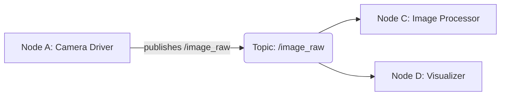
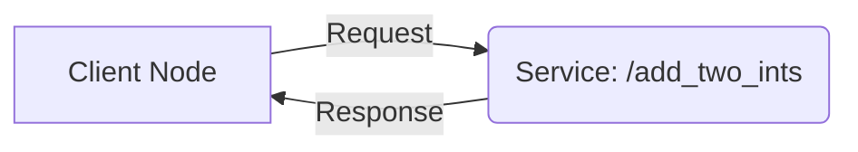

## Introduction to the Robotic Nervous System

The Robotic Operating System 2 (ROS 2) provides a flexible framework for writing robot software. It's not an operating system in the traditional sense, but rather a set of tools, libraries, and conventions that simplify the task of creating complex and robust robot applications. Think of it as the "nervous system" that allows different parts of your robot to communicate and work together.

### Why ROS 2?

ROS 2 addresses many of the limitations of its predecessor, ROS 1, particularly concerning multi-robot systems, real-time control, and industrial applications. Key improvements include:
*   **Quality of Service (QoS) Policies:** Fine-grained control over communication reliability, latency, and durability.
*   **Security:** Authentication, authorization, and encryption for secure robot operations.
*   **Multi-robot Support:** Designed from the ground up for distributed systems.
*   **Platform Agnostic:** Runs on various operating systems, including Linux, Windows, and macOS.

## Core ROS 2 Concepts

At the heart of ROS 2 are several fundamental concepts that enable modular and distributed robotics development.

### Nodes: The Workers

A **Node** is an executable process that performs computation. In a typical ROS 2 system, you'll have many nodes, each responsible for a specific task. For example, one node might control a motor, another might process camera data, and yet another might handle navigation.

Nodes are designed to be modular and reusable. They communicate with each other using various mechanisms, primarily topics and services.

### Topics: The Publication-Subscription Model

**Topics** are the most common way for nodes to exchange data. They implement a *publish-subscribe* communication model:
*   A node that wants to share information *publishes* messages to a named topic.
*   Nodes that want to receive that information *subscribe* to the same topic.

This is a one-to-many, asynchronous communication method. Publishers and subscribers are decoupled; they don't need to know about each other directly.



#### Example: Talker-Listener with `rclpy`

Let's illustrate this with a classic ROS 2 example: a "talker" node that publishes a message and a "listener" node that subscribes to it. We'll use `rclpy`, the Python client library for ROS 2.

**1. Create a ROS 2 Workspace**

First, set up a ROS 2 workspace:

```bash
mkdir -p dev_ws/src
cd dev_ws/src
ros2 pkg create --build-type ament_python my_package
cd ../..
colcon build
source install/setup.bash
```

**2. Talker Node (`talker.py`)**

Create `my_package/my_package/talker.py`:

```python
import rclpy
from rclpy.node import Node
from std_msgs.msg import String

class Talker(Node):
    def __init__(self):
        super().__init__('talker')
        self.publisher_ = self.create_publisher(String, 'chatter', 10)
        timer_period = 0.5  # seconds
        self.timer = self.create_timer(timer_period, self.timer_callback)
        self.i = 0

    def timer_callback(self):
        msg = String()
        msg.data = f'Hello ROS 2! Count: {self.i}'
        self.publisher_.publish(msg)
        self.get_logger().info(f'Publishing: "{msg.data}"')
        self.i += 1

def main(args=None):
    rclpy.init(args=args)
    talker_node = Talker()
    rclpy.spin(talker_node)
    talker_node.destroy_node()
    rclpy.shutdown()

if __name__ == '__main__':
    main()
```

Update `my_package/setup.py` in the `entry_points` section:

```python
'console_scripts': [
    'talker = my_package.talker:main',
],
```

**3. Listener Node (`listener.py`)**

Create `my_package/my_package/listener.py`:

```python
import rclpy
from rclpy.node import Node
from std_msgs.msg import String

class Listener(Node):
    def __init__(self):
        super().__init__('listener')
        self.subscription = self.create_subscription(
            String,
            'chatter',
            self.listener_callback,
            10)
        self.subscription  # prevent unused variable warning

    def listener_callback(self, msg):
        self.get_logger().info(f'I heard: "{msg.data}"')

def main(args=None):
    rclpy.init(args=args)
    listener_node = Listener()
    rclpy.spin(listener_node)
    listener_node.destroy_node()
    rclpy.shutdown()

if __name__ == '__main__':
    main()
```

Update `my_package/setup.py` in the `entry_points` section:

```python
'console_scripts': [
    'talker = my_package.talker:main',
    'listener = my_package.listener:main', # Add this line
],
```

**4. Build and Run**

```bash
cd dev_ws
colcon build --packages-select my_package
source install/setup.bash

# In one terminal
ros2 run my_package talker

# In another terminal
ros2 run my_package listener
```

You should see the listener node receiving messages from the talker node.

:::tip Understanding Message Types
ROS 2 uses various message types for different data. `std_msgs/msg/String` is a basic string message. For more complex data (like images, sensor readings, etc.), you'd use other predefined message types or define your own.
:::

### Services: Request-Response Communication

**Services** provide a *request-response* communication model. Unlike topics, which are asynchronous and one-to-many, services are synchronous and one-to-one. A client node sends a request to a service server node and waits for a response.



#### Example: Simple Service with `rclpy`

Let's create a simple service that adds two integers.

**1. Define the Service Interface**

Create `my_package/srv/AddTwoInts.srv`:

```
int64 a
int64 b
---
int64 sum
```

Update `my_package/package.xml` to add `buildtool_depend` for `rosidl_default_generators` and `exec_depend` for `rosidl_default_runtime`:

```xml
<buildtool_depend>ament_cmake</buildtool_depend>
<buildtool_depend>ament_python</buildtool_depend>
<buildtool_depend>rosidl_default_generators</buildtool_depend>
<exec_depend>rosidl_default_runtime</exec_depend>
```

Update `my_package/setup.py` to include the service definition:

```python
from setuptools import setup
import os
from glob import glob

package_name = 'my_package'

setup(
    # ... other metadata ...
    data_files=[
        ('share/' + package_name, ['package.xml']),
        ('share/' + package_name + '/srv', glob(os.path.join('srv', '*.srv'))), # Add this line
    ],
    # ... rest of setup.py ...
)
```

**2. Service Server (`add_two_ints_server.py`)**

Create `my_package/my_package/add_two_ints_server.py`:

```python
import rclpy
from rclpy.node import Node
from my_package.srv import AddTwoInts  # Import the custom service

class AddTwoIntsService(Node):
    def __init__(self):
        super().__init__('add_two_ints_server')
        self.srv = self.create_service(AddTwoInts, 'add_two_ints', self.add_two_ints_callback)
        self.get_logger().info('Add two ints service started.')

    def add_two_ints_callback(self, request, response):
        response.sum = request.a + request.b
        self.get_logger().info(f'Incoming request: a={request.a}, b={request.b}. Sending response: {response.sum}')
        return response

def main(args=None):
    rclpy.init(args=args)
    add_two_ints_server = AddTwoIntsService()
    rclpy.spin(add_two_ints_server)
    add_two_ints_server.destroy_node()
    rclpy.shutdown()

if __name__ == '__main__':
    main()
```

Update `my_package/setup.py` in the `entry_points` section:

```python
'console_scripts': [
    'talker = my_package.talker:main',
    'listener = my_package.listener:main',
    'add_two_ints_server = my_package.add_two_ints_server:main', # Add this line
],
```

**3. Build and Run**

```bash
cd dev_ws
colcon build --packages-select my_package
source install/setup.bash

# In one terminal
ros2 run my_package add_two_ints_server

# In another terminal (client call)
ros2 service call /add_two_ints my_package/srv/AddTwoInts "{a: 5, b: 3}"
```

You should see the server processing the request and the client receiving the response.

## ROS 2 CLI Commands

The `ros2` command-line interface (CLI) is a powerful tool for interacting with your ROS 2 system.

*   `ros2 node list`: List active nodes.
*   `ros2 topic list`: List active topics.
*   `ros2 topic info <topic_name>`: Display information about a topic.
*   `ros2 topic echo <topic_name>`: Display messages published on a topic.
*   `ros2 service list`: List active services.
*   `ros2 service type <service_name>`: Display the type of a service.
*   `ros2 service call <service_name> <service_type> <arguments>`: Call a service.

:::info Pro Tip: `rqt_graph`
For visualizing the nodes and topics in your running ROS 2 system, use `rqt_graph`.
```bash
ros2 run rqt_graph rqt_graph
```
:::

## Exercise: Custom Message Type

Create a new ROS 2 package or modify `my_package` to define a custom message type called `RobotStatus` with fields for `robot_id` (int), `battery_level` (float), and `status_message` (string). Create a publisher node that sends this message type and a subscriber node that receives and prints it.

Remember to:
1.  Define the `.msg` file.
2.  Update `package.xml` and `setup.py` to include the message definition.
3.  Build your package.
4.  Implement the publisher and subscriber nodes.

## Conclusion

Nodes, topics, and services are the foundational building blocks of any ROS 2 application. Mastering these concepts is crucial for developing robust and scalable robotic systems. In the next chapter, we'll explore how to bridge Python agents with ROS controllers.