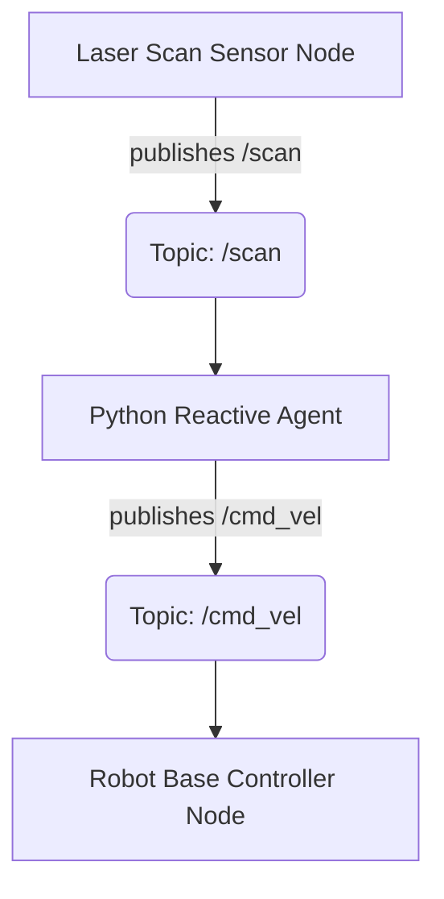

## The Concept of an Agent in Robotics

In robotics, an "agent" often refers to a system that perceives its environment through sensors and acts upon that environment through effectors. A Python agent, in this context, is a Python program designed to implement specific robot behaviors or decision-making logic. When combined with ROS 2, these Python agents can seamlessly integrate with the robot's hardware and other software components managed by the ROS 2 ecosystem.

### Why Python for Robotics Agents?

Python is a popular choice for robotics development due to:
*   **Ease of Use:** Simple syntax and rapid development cycle.
*   **Rich Ecosystem:** Extensive libraries for AI, machine learning, computer vision, etc.
*   **`rclpy`:** Excellent ROS 2 client library for Python, providing full access to ROS 2 functionalities.

## Building a Reactive Agent: Obstacle Avoidance

Let's develop a simple reactive agent that uses sensor data (simulated laser scans) to control a robot's movement (velocity commands). The agent will subscribe to `/scan` (laser scan data) and publish to `/cmd_vel` (command velocity).

### Agent Flow Diagram



### Tutorial: Reactive Obstacle Avoidance Agent

**Goal:** Create a Python node that subscribes to laser scan data and publishes velocity commands to avoid obstacles.

**1. Create a New ROS 2 Package**

If you don't have one, create a new package (or use `my_package` from the previous chapter):

```bash
mkdir -p dev_ws/src
cd dev_ws/src
ros2 pkg create --build-type ament_python obstacle_avoider
cd ../..
colcon build
source install/setup.bash
```

**2. Reactive Agent Node (`reactive_agent.py`)**

Create `obstacle_avoider/obstacle_avoider/reactive_agent.py`:

```python
import rclpy
from rclpy.node import Node
from sensor_msgs.msg import LaserScan
from geometry_msgs.msg import Twist

class ReactiveAgent(Node):
    def __init__(self):
        super().__init__('reactive_agent')
        self.publisher_ = self.create_publisher(Twist, 'cmd_vel', 10)
        self.subscription = self.create_subscription(
            LaserScan,
            'scan',
            self.laser_callback,
            10)
        self.subscription  # prevent unused variable warning
        self.get_logger().info('Reactive obstacle avoidance agent started.')

    def laser_callback(self, msg):
        # Simplistic obstacle avoidance logic
        # Check front, left-front, right-front regions for obstacles
        # LaserScan.ranges is a list of distances, usually from 0 (front) to end (front)
        # For a 360-degree LIDAR, 0 is front, len/4 is left, len*3/4 is right

        front_range = msg.ranges[len(msg.ranges) // 2] # Directly in front (approx)
        left_front_range = msg.ranges[len(msg.ranges) * 3 // 4] # Left-front (approx)
        right_front_range = msg.ranges[len(msg.ranges) // 4] # Right-front (approx)

        # Define a safe distance threshold
        obstacle_distance_threshold = 0.5 # meters

        twist_msg = Twist()
        twist_msg.linear.x = 0.0
        twist_msg.angular.z = 0.0

        if front_range < obstacle_distance_threshold:
            # Obstacle directly in front, turn right
            twist_msg.linear.x = 0.0
            twist_msg.angular.z = -0.5 # Turn right
            self.get_logger().warn(f"Obstacle detected ahead! Turning right. Range: {front_range:.2f}m")
        elif left_front_range < obstacle_distance_threshold:
            # Obstacle on left-front, turn right
            twist_msg.linear.x = 0.0
            twist_msg.angular.z = -0.3 # Gently turn right
            self.get_logger().warn(f"Obstacle detected left-front! Turning right. Range: {left_front_range:.2f}m")
        elif right_front_range < obstacle_distance_threshold:
            # Obstacle on right-front, turn left
            twist_msg.linear.x = 0.0
            twist_msg.angular.z = 0.3 # Gently turn left
            self.get_logger().warn(f"Obstacle detected right-front! Turning left. Range: {right_front_range:.2f}m")
        else:
            # No immediate obstacles, move forward
            twist_msg.linear.x = 0.2
            twist_msg.angular.z = 0.0
            self.get_logger().info(f"Path clear. Moving forward. Front: {front_range:.2f}m")

        self.publisher_.publish(twist_msg)

def main(args=None):
    rclpy.init(args=args)
    reactive_agent = ReactiveAgent()
    rclpy.spin(reactive_agent)
    reactive_agent.destroy_node()
    rclpy.shutdown()

if __name__ == '__main__':
    main()
```

Update `obstacle_avoider/setup.py` in the `entry_points` section:

```python
'console_scripts': [
    'reactive_agent = obstacle_avoider.reactive_agent:main',
],
```

**3. Build and Run**

To run this agent, you'll need a simulated environment that publishes `/scan` messages and subscribes to `/cmd_vel`. Gazebo with a robot model (like `turtlebot3_gazebo`) is ideal.

```bash
cd dev_ws
colcon build --packages-select obstacle_avoider
source install/setup.bash

# In one terminal, launch a simulated robot (e.g., TurtleBot3 Burger in Gazebo)
# ros2 launch turtlebot3_gazebo turtlebot3_world.launch.py

# In another terminal, run your reactive agent
ros2 run obstacle_avoider reactive_agent
```

Observe how the robot in the simulation tries to avoid obstacles based on the laser scan data.

### Best Practices for Python Agents in ROS 2

*   **Modularity:** Keep your agent logic encapsulated within its own node.
*   **Clear Interfaces:** Use well-defined ROS 2 topics and services for communication.
*   **Asynchronous Processing:** Leverage `rclpy`'s asynchronous capabilities for non-blocking sensor processing and command publishing.
*   **Error Handling:** Implement robust error handling for sensor data validation and communication failures.
*   **Logging:** Use `self.get_logger()` for informative debugging and operational monitoring.
*   **Testing:** Write unit tests for your agent's logic.

## Exercise: Enhanced Obstacle Avoidance

Modify the `ReactiveAgent` to implement a more sophisticated avoidance strategy. Consider:
1.  **Multiple regions:** Divide the laser scan into more granular regions (e.g., far-left, left, center-left, center-right, right, far-right).
2.  **Proportional control:** Instead of fixed turn rates, make the angular velocity proportional to the inverse of the distance to the nearest obstacle.
3.  **Wall following:** If an obstacle is detected, try to maintain a certain distance from it while moving forward.
4.  **Priority:** Give higher priority to avoiding obstacles directly in front.

## Conclusion

Python agents, leveraging `rclpy`, offer a powerful and flexible way to develop complex robot behaviors within the ROS 2 framework. By understanding how to interface with ROS 2 topics and services, you can build intelligent agents that transform sensor data into meaningful actions, bringing your robots to life. In the next chapter, we will delve into the Unified Robot Description Format (URDF) for modeling humanoids.